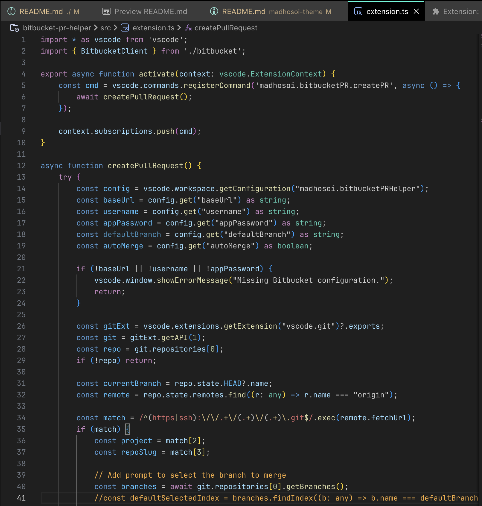

# MadHosoi Dark Theme

Forked from Dark Modern, but with some tweaks that help us to work as a PRO.

## Installation

Preferences:

1. Go to `Extensions`
2. Search for `Panda` and install it.
3. Go to `Color Themes` and choose `MadHosoi Theme` as the color theme or `CMD + Shift + P` and enter Command `> color theme` and choose `MadHosoi Theme`.
